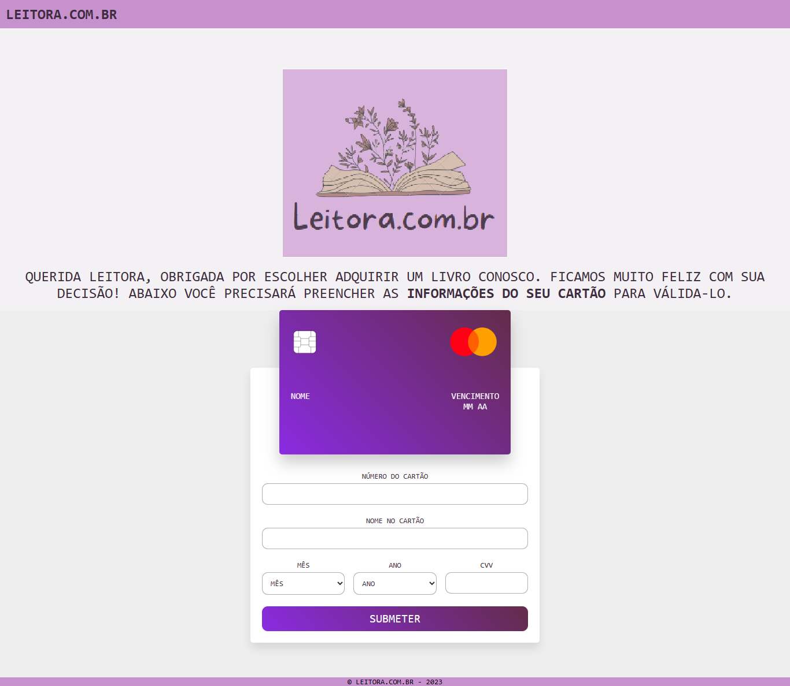

# 📚 Leitora.com.br - Validação de Cartão de Crédito 💳 

## Descrição 📝
Projeto idealizado no Bootcamp da Laboratória.
Neste projeto, foi preciso criar um aplicativo da Web que permita ao usuário validar o número de um cartão de crédito e implementar a funcionalidade para ocultar todos os dígitos de um cartão, exceto os quatro últimos. 

## Descrição do Produto ✨

O **"Leitora.com.br"** simula uma validação de cartão de crédito para finalização de compras de livros. O produto tem como objetivo alcançar usuários leitores marjoritariamente femininos, no qual a ideia é ter uma interação fácil e de forma simples e intuitiva ao preencher os dados solicitados.

## Recursos 📌

- **Validação de Cartão de Crédito:** Verifica se o número do cartão de crédito é válido.
- **Exibição Parcial do Número do Cartão:** Apenas os últimos 4 dígitos do cartão são visíveis, garantindo segurança.

## Instruções de uso 💻

1. Insira o número do seu **cartão de crédito** (use apenas dígitos numéricos [0-9]) para validação.
2. Informe o **nome do titular do cartão** associado ao cartão de crédito.
3. Escolha o **mês de validade** e o **ano** no menu suspenso.
4. Passe o mouse sobre o campo **CVV** para ver a parte de trás do cartão.
5. Envie o formulário para validar o cartão de crédito.

## Testes 🤓

- `isValid(creditCardNumber)`: Testa se o número do cartão de crédito é válido usando o algoritmo de Luhn.
- `maskify(CreditCardNumber)`: Mascarar o número do cartão de crédito, revelando apenas os últimos 4 dígitos.

## Feedback 💁‍♀️
Seu feedback é valioso! Se você encontrar algum problema ou tiver sugestões de melhorias, por favor, entre em contato!

## Autora 👩‍💻
- [Ádila Freitas](https://github.com/adilamarcelefreitas) - Estudante Dev Front-End.

